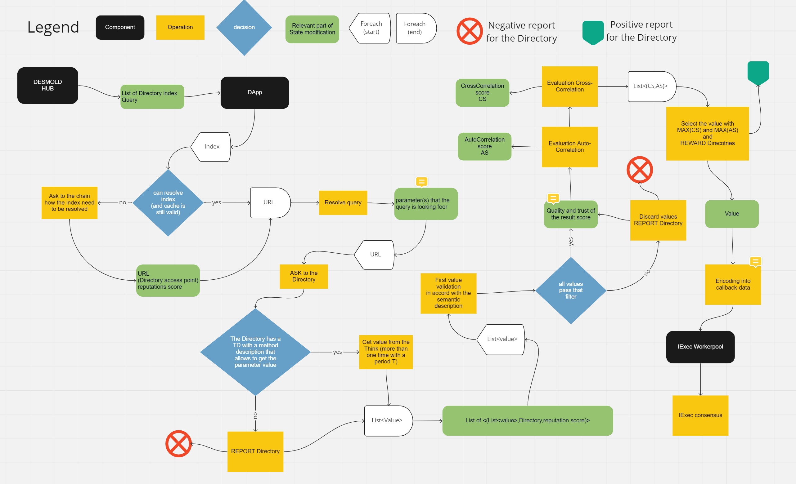

# DESMO-LD DApp - Iexec Oracle implementation

 

**Overview** 

> Desmo-LD will leverage on iExec distributed cloud computing features to deploy its
off-chain Oracle components. The Oracle DApp is an IExec decentralized application
written in node-js (Typescript) which acts as the backend of Desmo-LD iExecDOracle. In
particular, it is in charge of parsing and translating the on-chain oracle requests,
collecting the results from the selected TDDs, reaching a consensus on the Web
Thing response, and returning the response. Thanks to iExec secure environment
facilities, enabled Web Things can be operated within a secure enclave where
credentials can be shared without any risk of information leaking.

<!-- TABLE OF CONTENTS -->

  
Table of Contents

  <ol>
    <li>
      <a href="#system-architecture">System Architecture</a>
    </li>
    <li>
      <a href="#getting-started">Getting Started</a>
    </li>
    <li>
    <li><a href="#acknowledgments">Acknowledgments</a></li>
    </li>
    <li><a href="example-tds/README.md">WAM for TDs example management</a></li>
    <li><a href="directory/README.md">Linksmart Directory for Directories example</a></li>
    <li><a href="DApp/README.md">DApp</a></li>
    <dd><li><a href="DApp/docs/algorithm.md">Consensus algorithm for TDs result</a></li></dd>
    <dd><li><a href="DApp/docs/encoding.md">Econding result</a></li></dd>
    <dd><li><a href="docs/uml.md">UML</a></li></dd>
  </ol>

# System Architecture

[FlowChart link](https://miro.com/app/board/uXjVODIdhHI=/?invite_link_id=916009864260)

# Getting started
Here you can find a short way to configure all the services that you need to run the DApp.
If you need more details about these services, you can find them in their section, look at the [Table of Contents](#Table-of-Contents) 

**SETUP**

1. WAM
    1. `cd ./example-tds`
    2. `npm install`
    3. `npm run build`
    4. `npm start`
2. `cd ..`
3. Directory
    1. `cd ./directory` 
    2. Download and install GO [go.dev](https://go.dev/dl/)
    3. `./downloadRepo.sh`
    5. `cd ./directoryManager` 
    6. `npm install` 
    7. `npm start` 
4. `cd ../../`
5. DApp
    1. `cd ./DApp` 
    2. `npm install -g ts-node typescript '@types/node'`

**RUN TEST**

1. WAM
    1. `cd ./example-tds`
    4. `npm start`
2. `cd ..`
3. Directory
    1. `cd ./directory`
    4. `./buildAndRunMultiple.sh`
    7. `./setupMultiple.sh` 
4. `cd ../../`
5. DApp
    1. `cd ./DApp` 
    2. `ts-node tests/runTests.ts usecase`

**Zion as Directory**

Zion is an Directory implementation, you can find the [Zion repository here](https://github.com/vaimee/zion)

The final demo of DESMO-LD project will use Zion Directories, to use an isntace of that with docker:
1. download the repository [here](https://github.com/vaimee/zion)
2. `docker-compose up`

To test the DApp with Zion as Direcotry: 
1. WAM
    1. `cd ./example-tds`
    4. `npm start`
2. `cd ..`
3. Directory
    1. if Zion is not up yet, go in the Zion repository folder and then `docker-compose up`
5. DApp
    1. `cd ./DApp`
    2. `ts-node tests/runTests.ts zion`

## Acknowledgments

DESMO-LD DApp is founded by the [DESMO-LD project](https://ontochain.ngi.eu/content/desmo-ld) inside the [ONTOCHAIN](https://ontochain.ngi.eu/) european organization part of the [Next Generation Internet](https://www.ngi.eu/) fund.